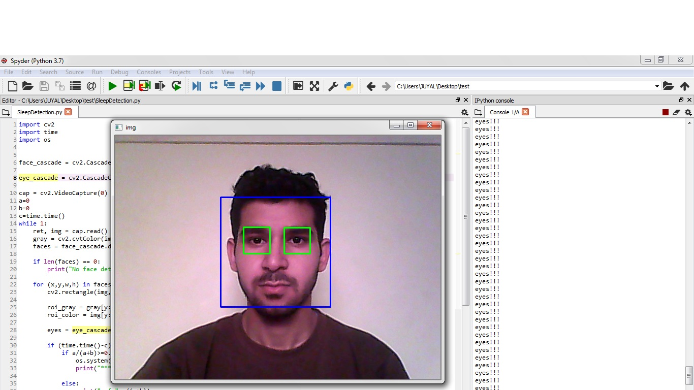

# Drowsyness-Detection

<!-- PROJECT LOGO -->
<!-- hello u know what time it is? -->
<!-- it's disco time -->
 

  
 

_______________________________________________________________________________________________________________________________________________________________________

## Dataset: <a href="https://drive.google.com/drive/folders/1HNk3O4uMNWmE09DQYzfmYsLevW3oOPvT?usp=sharing">Click Here</a>

<h3 align="left">Made With</h3>

 

 

## How to run the program:
* Make sure to have Python version 10 or above and a Text Editor.
* Install the dependencied by running `pip install -r requirements.txt`
* Make sure `haarcascade_frontalface_default.xml`, `haarcascade_eye_tree_eyeglasses.xml` and `buzz.mp3` are in the same directory as `SleepDetection.py`.   
* Run the `SleepDetection.py` file after completing the previous steps.
    
 
  

<!-- MARKDOWN LINKS & IMAGES -->
<!-- https://www.markdownguide.org/basic-syntax/#reference-style-links -->
[contributors-shield]: https://img.shields.io/github/contributors/jagreetdg/Dseized-Bot.svg?style=for-the-badge
[contributors-url]: https://github.com/TheCleverIdiott/AI-Score-Predictor/graphs/contributors
[license-shield]: https://img.shields.io/github/license/jagreetdg/Dseized-Bot.svg?style=for-the-badge
[license-url]: https://github.com/TheCleverIdiott/AI-Score-Predictor/blob/main/LICENSE

